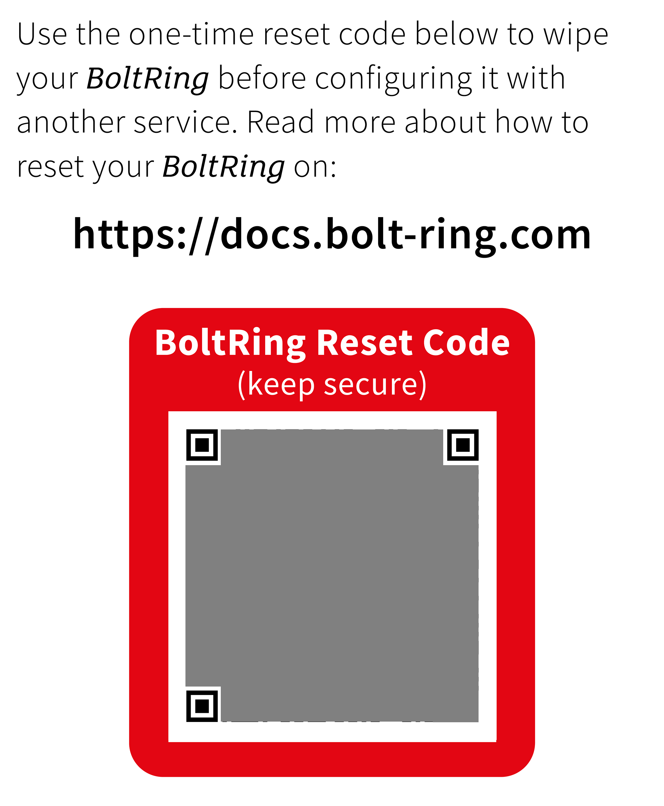
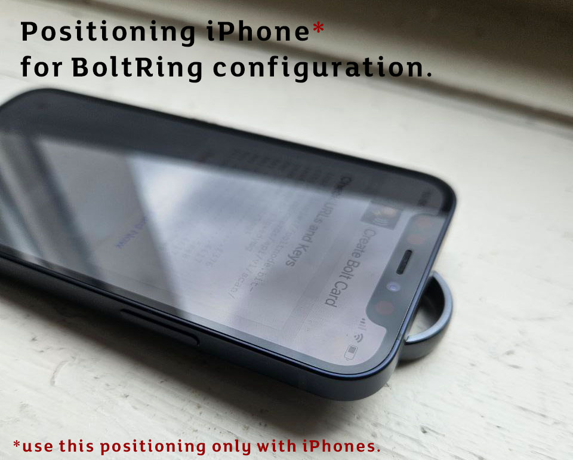
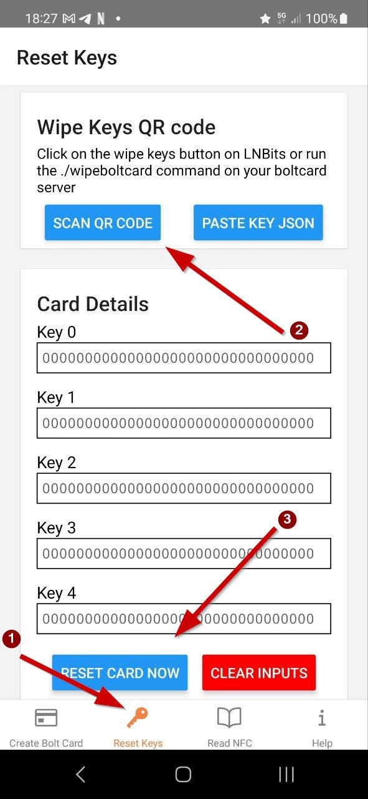

# How to reset your BoltRing

If your BoltRing is already paired with a lightning wallet, and you want to connect it to another 
BoltService you first need to reset your BoltRing. Your BoltRing configuration is protected by 
secret keys which you need to reset your BoltRing. 

!!! danger "Backup your Keys"

    You need keys to re-configure your BoltRing. **Without keys you cannot reset or re-configure
    your device!**

    Keys are initialy set to ZERO at factory settings unless you bought a pre-configured BoltRing.
    For pre-configured BoltRings the keys are printed as QR code on the enclosed leaflet.
 
    After you re-configured your BoltRing **you will need the newly set keys** for any further 
    re-configuration (the original keys will not work anymore).


## BoltRing Reset Code

{ align=right width=30% }

If you received a pre-configured BoltRing, the reset code is printed on the leaflet that came with
it. This QR code includes all the data required to reset your BoltRing to factory
defaults. When you read the QR Code you should get data that looks like this:

```json
{
  "action": "wipe",
  "k0": "dc41a9fc8db3766bf5e9f65b0f6f648e",
  "k1": "1a5aae9505a61f5b70b01deca990f728",
  "k2": "6f8cafe391f9181f7a72d778b816714b",
  "k3": "4d17d81c7c7a9a226a388f1e71addd15",
  "k4": "2fa4bf8c8e6d3e964459732627afc94e",
  "uid": "04DE663B7EA0A5",
  "version": 1
}
```

## Reset with Bolt Card Creator

In addition to the reset code you will also eed an Android Phone with NFC support.

If you have an **Android** phone install the [Bolt Card NFC Card Creator App](https://play.google.com/store/apps/details?id=com.lightningnfcapp) from Google Play.
If you are using an **iPhone** install the [Boltcard NFC Programmer](https://apps.apple.com/us/app/boltcard-nfc-programmer/id6450968873) from the App Store.

Make sure that NFC is enabled on your mobile phone before launching the app.

!!! tip "TIPS: NFC chip reset"
    { align=right width="60%"}

    **Important**: If writing to the BoltRing NFC chip is interruped you may end up with a defect
    ring. Be sure to:

    - Remove any cover or shell from your phone before configuring your BoltRing.
    - Find out where the NFC chip antenna is positioned in your phone (using read tests).
    - Put the BoltRing on a table and the phone´s antenna on top of it in a stable position.
    - Wait a few seconds after writing before moving your phone.

    If you are using an **iPhone**, put it on top of the BoltRing as shown on this image before 
    hitting the **Reset Card Now** button.


!!! noborder ""
    { align=right width="40%"}

    **BoltRing Reset Steps**


    1. Select the `Reset Keys` tab at the bottom of your start screen
    1. Tap the `SCAN QR CODE` button to read the reset code (the card details should show your keys
       now)
    1. Position your phones antenna on top of your BoltRing in a stable way and tap the 
       `RESET CARD NOW` button
    1. Hold the device still and wait until the app confirms that the keys are reset.

    **Congratulations your BoltRing is reset to factory defaults and can now be configured with
    another wallet**

