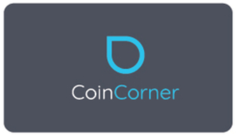
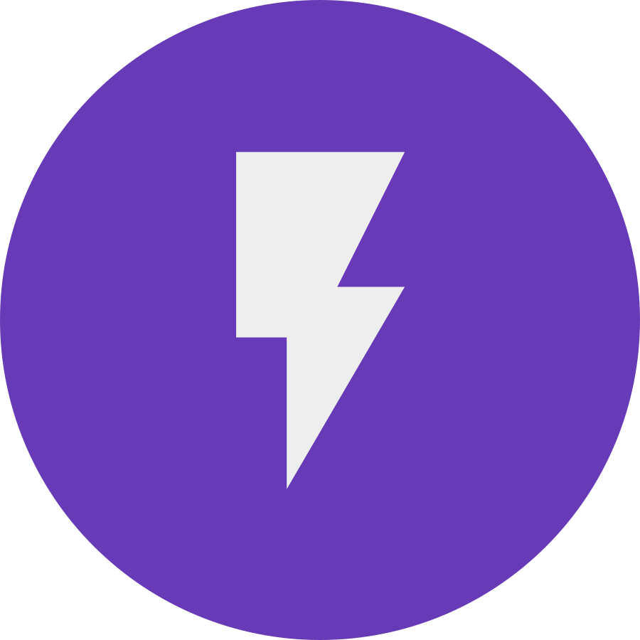
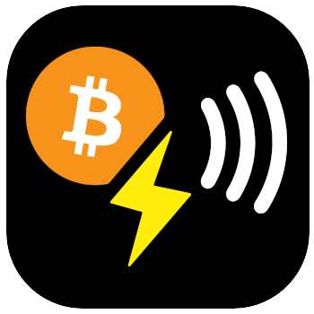

# Getting started with your BoltRing

To use your **BoltRing** you must pair it with a Bolt Card service. The service is then responsible
for verifying and processing the unique payment URLs generated by your BoltRing according to the
configured payment rules.

As always, with Bitcoin, there are different options for setting up, operating, or using a Bolt Card
service for your BoltRing, with varying features and tradeoffs.

## BoltRing Pairing Options

| Service                               | Custodial | Open Source | Exchange | Difficulty |
| ------------------------------------- | --------- | ----------- | -------- | ---------- |
| [CoinCorner](#coincorner)             | Yes       | No          | Yes      | Easy       |
| [LNbits](#lnbits)                     | Yes/No    | Yes         | No       | Medium     |
| [Bolt Card Server](#bolt-card-server) | No        | Yes         | No       | Advanced   |

### CoinCorner

[{ align=right width=30% }](https://www.coincorner.com/?AffiliateId=126082)

For non-technical folks and iPhone users, CoinCorner is probably the easiest way to get started.
CoinCorner launched the Bolt Card in May 2022. They offer many Bitcoin-related services for users
and merchants, including a custodial lightning wallet and fiat exchange services.

If you sign up with CoinCorner, you can easily pair your BoltRing with their mobile lightning wallet
using any NFC-capable iPhone or Android device. The pairing procedure is the same as with the Bolt
Card. Use our referral link to sign up:

[Go with CoinCorner](https://www.coincorner.com/?AffiliateId=126082){.md-button .md-button--primary}

### LNbits

[{ align=right width=20% }](/lnbits)

LNbits is a free, open-source lightning account system with many features, including a Bolt Card
extension. You can use a hosted LNbits service or, provided that you have the necessary technical
skills, install and operate your own LNbits service.

[LNbits Setup Guide](/lnbits){.md-button .md-button--primary}

### Bolt Card Server

[{ align=right width=20% }](https://github.com/boltcard/boltcard)

Another option is the Bolt Card project on GitHub. The project hosts a GitHub repository with the
code for a Bolt Card server application that you can operate in conjunction with a Bitcoin Lightning
node. If you choose this path, you will need solid technical skills, but you will be rewarded with
extended configuration options.

[Bolt Card Server](https://github.com/boltcard/boltcard){.md-button .md-button--primary}
