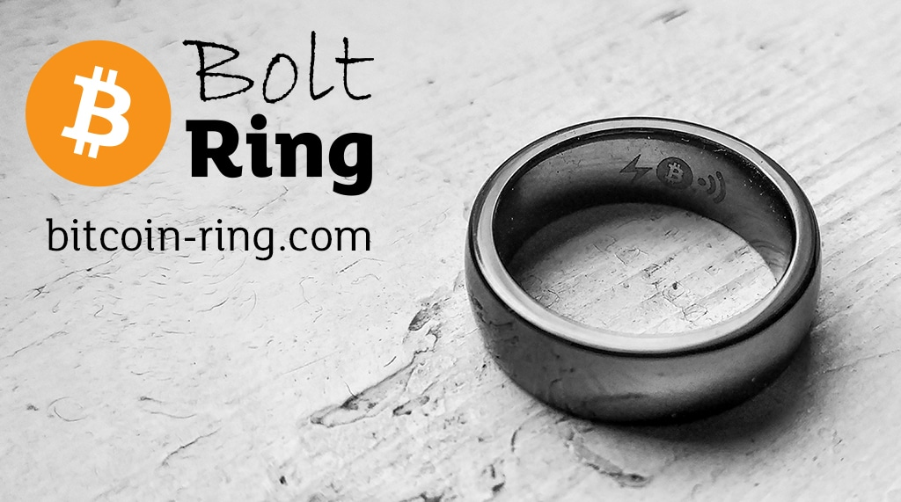

# BoltRing Documentation

**Contactless Payments over Bitcoin Lightning**

Welcome to the world of contactless bitcoin lightning payments with the **BoltRing**! We're excited
to offer this cutting-edge product to early adopters interested in exploring new technologies and
pushing the boundaries of what's possible.

The BoltRing is the first Bitcoin DIY contactless payment ring that brings the *tap-to-pay*
experience to Bitcoin Lightning. You can use the BoltRing with your self-sovereign Bitcoin Lightning
node or a commercial service provider.

**A Community Effort**

The capabilities of the BoltRing are the results of contributions from developers and enthusiasts
all around the world - most notably https://www.boltcard.org/. Using this technology means being
part of a global community of people who believe in the power of permissionless, decentralized,
peer-to-peer transactions.

By adopting this technology, you are not only getting access to cutting-edge payments capabilities,
but you also get the opportunity to shape and influence the development of the technology while
supporting a movement that aims to democratize access to financial services and promote financial
freedom.

**The State of Development**

Please note that the BoltRing is still in its early stages. It is currently only supported by a
limited number merchants, wallets, and the setup of the BoltRing may still be technically
challenging. However, we believe that the benefits of using contactless payment technology for
Bitcoin are worth the effort, and we are here to support you every step of the way.

**About the Documentation**

Our documentation is designed to guide you through every step, making it as easy as possible. We
encourage you to experiment with the BoltRing and not to be afraid to try new things. By working
through the documentation, you'll be able to take advantage of the ring's capabilities and learn
about the underlying technology and how it all works.

The documentation will cover all the necessary steps to get started and to be able to make your
first bitcoin payments with the BoltRing. We will review the software and hardware requirements, the
setup process, and how to pair the ring with a lightning service and your mobile wallet. From there,
you can make convenient and contactless bitcoin payments.

**Let´s go**

We hope you enjoy using your new BoltRing, and we look forward to your feedback and suggestions.
Please do not hesitate to reach out to us if you have any questions or encounter any issues. Let's
take the first steps in NFC-based bitcoin payments together!
