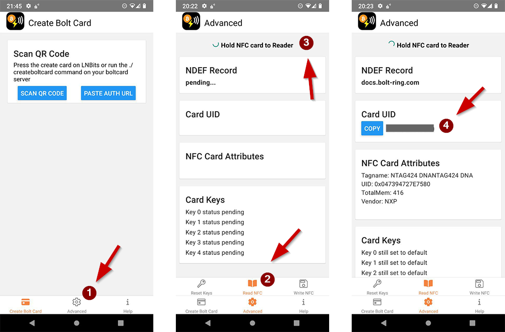

# BoltRing LNbits Setup

LNbits is a free, open-source lightning account system with Bolt Card support. This guide shows you
how to pair your BoltRing with the [LNbits](https://lnbits.com/) Bolt Card extension.

!!! danger "Security notice"
    In this guide, we use a public demo installation of LNbits, which means **you must trust the
    service operators** to guard your satoshis. **Don´t be reckless**; use it with caution and only
    for testing with small amounts.

!!! tip "Use your own LNbits server"
    You can also use this guide to pair your BoltRing with your self-hosted LNbits server. But be
    aware that your LNbits server has to be publicly reachable over clearnet with a https URL. **A
    default Umbrel installation of LNbits will not work!**

## Step 0 - Requirements

- An existing Lightning Wallet that you can use to fund your LNbits account
- An Android Mobile Phone with NFC support to provision your BoltRing
- A BoltRing that has not been set up yet (or has been wiped)

!!! tip "I don´t have an Android Phone!"
    You will only need the Android Phone for the initial setup of your BoltRing. You could borrow an
    Android Phone from a friend to do the setup. Another option for iPhone users is the
    [CoinCorner](https://www.coincorner.com/) service. CoinCorner supports BoltCard setup on both
    Android and iPhone devices.

## Step 1 - Install Bolt Card Creator

Install the
[Bolt Card Creator Android App](https://play.google.com/store/apps/details?id=com.lightningnfcapp)

You will need this app later to write the bolt service configuration to the BoltRing. You will also
need the NFC UID of your BoltRing for this set-up. You can find it on the leaflet that came with
your BoltRing.

If you have your UID and are in a hurry, you can skip the next section and continue with step 2.

**Read BoltRing NFC UID**

1. Select the `Advanced` tab at the bottom of the start screen of the Bolt Card Creator App
1. Select the `Read NFC` tab on the stacked menu
1. Scan your BoltRing by holding it to the back of your phone
1. Take note of the UID of your BoltRing

!!! tip "Memorize the NFC antenna location"
    Smartphones have their NFC antenna in different places. Usually, it is in the upper third of the
    back of the phone. While scanning the BoltRing, pay attention to the position the app detects
    the BoltRing. Knowing the antenna position will give you more confidence when writing the
    configuration to the BoltRing later.

!!! bug "Error: This NFC card has not been formatted."
    If you get this error, you can use the
    [NXP TagWriter App](https://play.google.com/store/apps/details?id=com.nxp.nfc.tagwriter) to
    erase and format your tag as NDEF.

## Step 2 - Create an LNbits Wallet

!!! tip "Do these steps from a PC"
    The guide assumes you create your LNbits wallet from a desktop PC.

- Browse to https://legend.lnbits.com/
- Type a memorable name for your wallet
- Click `ADD A NEW WALLET`
- Take note of your Wallet-URL

!!! danger "Secure your Wallet-URL"
    The LNbits wallet you created does not have a password-protected login. The **Wallet-URL** shown
    in the browser after completing the setup IS YOUR PASSWORD/LOGIN. **So please make a backup of
    the full Wallet-URL and keep it a secret**.

## Step 3 - Fund Your Wallet

Click the `CREATE INVOICE` button and send some satoshis to your LNbits wallet.

## Step 4 - Install Extension

Activate the LNbits Bolt Card Extension for your wallet as follows:

- Click on `Manage Extensions` in the left menu
- Click `ENABLE` on the Bolt Cards tile
- Click `OPEN` or the new `Bolt Cards` item in the left menu

## Step 5 - Create Bolt Card Service

- Click the orange `plus` button on the Bolt Cards Extension screen

On the card creation form:

1. Select the LNbits wallet you created before
1. Set a limit of satoshis per transaction (for example, 100 000)
1. Set a limit of satoshis per day (for example, 600 000)
1. Type a memorable name for your BoltRing
1. Enter the NFC UID of your BoltRing
1. Click `CREATE CARD`

After clicking `CREATE CARD`, you should see the card service created. Click the QR Code in the
first column of the list to show the QR code you need in the next step.

!!! noborder ""
    { align=right width="40%"}
    After clicking the QR code symbol, you should see this card creation popup.

    **Make sure you back up the keys shown below the QR code.** You will need them to reset/wipe
    your BoltRing later. Should LNbits become unavailable, these keys will be the only way to
    recover/reset your BoltRing.

    Keep the popup window open; you will need to scan the shown QR code in the next step.

## Step 6 - Pairing Your BoltRing

Now you will pair you BoltRing with the LNbits BoltCard Extension. Go to your mobile phone and start
the Bolt Card Creator App you installed earlier. Place your BoltRing on a table, so it is ready to
be paired.

!!! warning
    Please make sure you go through these last steps in one go, because the QR code from the
    previous step will be invalidated when you scan it. **Make sure you hold your phone above the
    BoltRing at the correct position and hold it still and long enough for the pairing to
    complete.** If you close the App before writing the pairing data to the BoltRing, you must start
    over from [step 5](#step-5-create-bolt-card-service) and create a new card service entry.

1. Go to the start screen of the Bolt Card Creator app
1. On the start screen, tap `SCAN QR CODE` and scan the LNbits card creation QR code
1. Tap "WRITE CARD NOW" and position your phone´s NFC antenna close above the BoltRing
1. Verify that the app `Output` section shows all the green checkmarks

**Congratulations, your BoltRing is now ready for use.**

