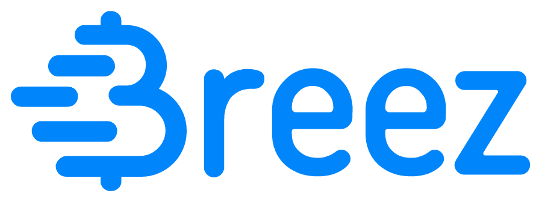

# BoltRing compatibility

The BoltRing compatible with the open [LUD-17](https://github.com/lnurl/luds/blob/luds/17.md) LNURLW
standard. The following Wallets and POS systems support accepting BoltRing payments:

## Breez Mobile

[{ align=right width=30% }](https://breez.technology)

The Breez Mobile app for Android and iPhone offers simple non-custodial Point-of-Sale functionality,
including the possibility to accept Lightning NFC payments.

[Breez Mobile](https://breez.technology/mobile){.md-button .md-button--primary}

## BTCPay Server

[{ align=right width=28% }](https://btcpayserver.org/)

BTCPay Server is a comprehensive self-hosted, open-source Bitcoin payment processor. The LNURL NFC
plugin supports NFC payments for the included Point-of-Sale app.

[BTCPay Server](https://btcpayserver.org){.md-button .md-button--primary}

## CoinCorner Checkout

[{ align=right width=30% }](https://www.coincorner.com/checkout)

CoinCorner Checkout is a hosted bitcoin payment solution for merchants and other businesses. Their
Point-of-Sale mobile app supports Lightning NFC payments.

[CoinCorner Checkout](https://www.coincorner.com/checkout){.md-button .md-button--primary}

## LNbits TPoS

[{ align=right width=20% }](https://github.com/lnbits/lnbits/tree/main/lnbits/extensions/tpos)

LNbits is a free, open-source Lightning account system. It comes with the TPoS extension, a
Point-of-Sales app that supports Lightning NFC payments.

[LNbits TPoS](https://lnbits.com){.md-button .md-button--primary}
