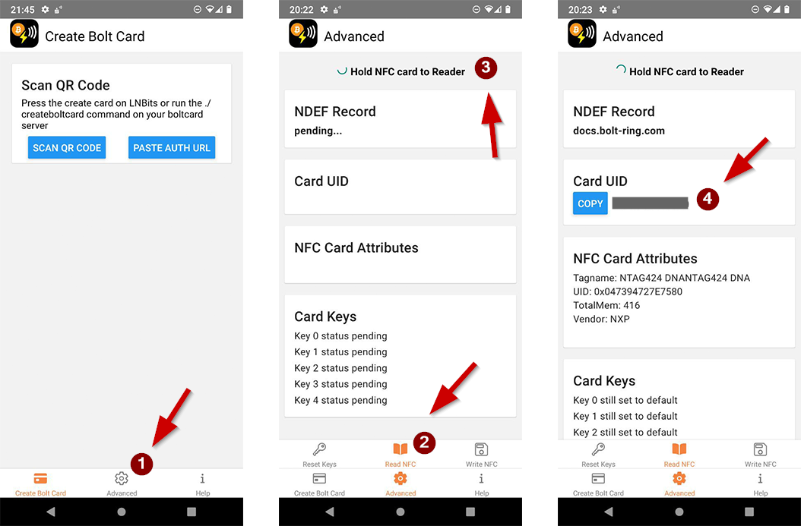
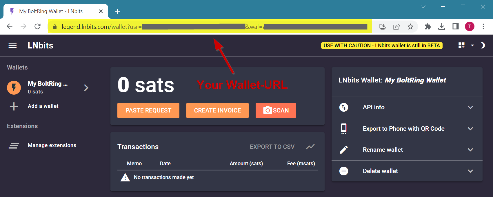
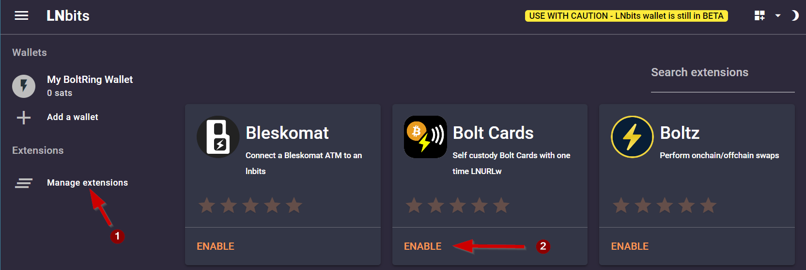
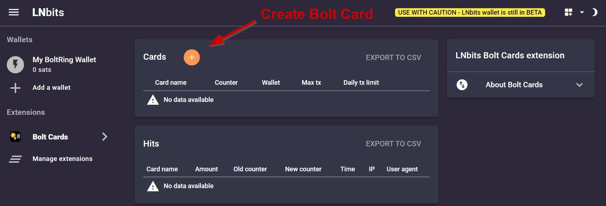
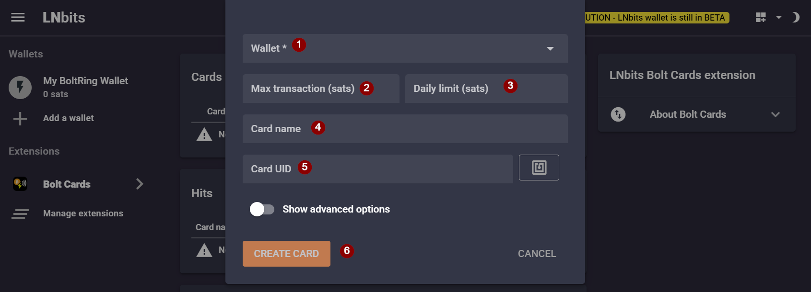

# BoltRing Quickstart

There are many options for setting up and using your **BoltRing** with varying tradeoffs regarding
convenience, security, and features. In this quickstart guide we show you a setup the BoltRing with
[LNBits](https://lnbits.com/) and the Bolt Card extension. LNBits is a free open-source lightning
account system.

!!! danger "Safety notice"
    In this guide we use a public demo installation of LNbits. This means you are trusting the
    operators of the service with guarding your satoshis. **Don´t be reckless** and use it with
    caution and only for testing with small amounts.

## Step 0 - What you need

- An existing Lightning Wallet that you can use to fund your LNBits account
- An Android Mobile Phone with NFC support to provision your BoltRing
- A BoltRing that has not been set up yet (or has been wiped if setup previously)

!!! tip "I don´t have an Android Phone!"
    You will only need the Android Phone for the initial setup of your BoltRing. So you could borrow
    an Android Phone from a friend to do the setup. Another option for iPhone users is the
    [CoinCorner Wallet](https://www.coincorner.com/). The CoinCorner App supports BoltCard setup on
    both Android and iPhone devices.

## Step 1 - Install Bolt Card Creator

Install the
[Bolt Card creator app](https://play.google.com/store/apps/details?id=com.lightningnfcapp)

You will need this app later to write the bolt service configuration to the BoltRing. You will also
need the NFC UID of your BoltRing for this setup. It should be printed on the leaflet that came with
your BoltRing.

If you have your UID and you are in a hurry you can skip the next section and continue with step 2.

**Read BoltRing NFC UID**

1. Select the `Advanced` tab at the bottom of the start screen of the Bolt Card Creator App
1. Select the `Read NFC` tab on the stacked menue
1. Scan your BoltRing by holding it to the back of your phone
1. Take note of the UID of your BoltRing

!!! tip "Memorize NFC antenna location"
    Smartphones have their NFC antenna in defferent places. Ususally it is in the upper third of the
    back of the phone. While scanning the BoltRing pay attention at what position the app detects
    the BoltRing. This will give you more confidence when writing the configuration to the BoltRing
    later on.

## Step 2 - Create an LNBits Wallet

- Browse to https://legend.lnbits.com/
- Type a memorable name for your wallet
- Click "ADD A NEW WALLET"
- Take note of you Wallet-URL

!!! danger "Secure your Wallet-URL"
    The LNBits wallet you created does not have a password protected login. The **Wallet-URL** shown
    in the browser after creating the wallet IS YOUR PASSWORD/LOGIN. **So make a backup of the full
    Wallet-URL and keep it a secret**.

## Step 3 - Fund your wallet

Click the `CREATE INVOICE` button and send some satoshis to your LNbits wallet.

## Step 4 - Install Extension

Activate the LNBits Bolt Card Extension for your wallet as follows:

- Click on `Manage Extensions` in the left menue
- Click `ENABLE` on the Bolt Cards tile
- Click `OPEN` or the new `Bolt Cards` item in the left menue

## Step 5 - Create Bolt Card Service

- Click the orange plus-button on the Bolt Cards Extension screen

On the card creation form:

1. Select the wallet you created in [Step 1](#step-1-create-an-lnbits-wallet)
1. Set a limit of satoshis per transaction (for example 50000)
1. Set a limit of satoshis per day (for example 300000)
1. Type a memorable name for your BoltRing
1. Enter the NFC UID of your BoltRing
1. Click `Create Card`

## Step 6 - Provision your BoltRing

To connect your BoltRing with the LNbits Bolt Card service you need to burn the service
configuration to the BoltRing.

TBD
